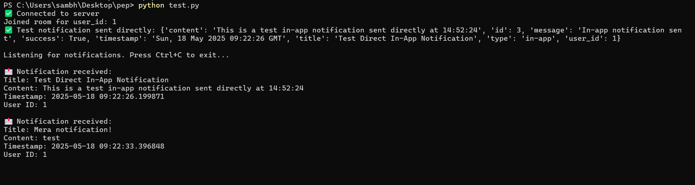

# 📬  PepSales Notification Service Assignment

A simple web-based notification management system built with Flask. This app allows users to send and retrieve notifications of various types (Email, SMS, In-App), including **real-time In-App notifications using WebSocket**.


## 🚀 Features

- Send notifications via a form (Email, SMS, or In-App)
- Dynamically render additional input fields based on notification type
- Fetch all notifications for a user
- Fetch a specific notification using user ID and notification ID
- Real-time in-app notifications using WebSocket (separate client)
- Persistent storage using SQLAlchemy (default: SQLite)


## 🛠️ Tech Stack

- **Backend**: Python, Flask
- **Testing**: Postman
- **WebSocket Client**: Python WebSocket (for in-app message reception)

## 📁 Project Structure
```
PEP/
├── app.py                    # Main Flask application
├── models.py                 # SQLAlchemy models
├── routes.py                 # Route definitions for API endpoints
├── notification_service.py   # Business logic to handle notifications
├── notification_worker.py    # Background worker (e.g., RabbitMQ consumer)
├── rabbitmq_producer.py      # Sends messages to RabbitMQ queue
├── server_socket_events.py   # WebSocket event handling for Flask-SocketIO
├── socketio_instance.py      # Singleton instance for SocketIO
├── test.py                   # WebSocket client to test in-app notifications
├── myenv.env                 # Environment variables file
└── screenshots/              # Screenshots for README
```

## 🔐 Environment Variables

Create a `.env` file in the root directory with the following keys:

```
# SMTP (for sending emails)
SMTP_SERVER=smtp.gmail.com
SMTP_PORT=587
EMAIL_SENDER=dev.ksambhav@gmail.com
EMAIL_PASSWORD=your_app_specific_password_here

# Twilio (for sending SMS)
TWILIO_SID=your_twilio_sid
TWILIO_AUTH_TOKEN=your_twilio_auth_token
TWILIO_PHONE=your_twilio_phone_number

# RabbitMQ (for message queuing)
RABBITMQ_HOST=localhost
RABBITMQ_QUEUE=notification_queue
```


## 📦 Installation & Running

### 1. Clone the Repository

```bash
git clone https://github.com/kumarwhocodes/pep.git 
cd pep
```

### 2. Create a Virtual Environment (Mandatory as it contains config details)

```bash
python -m venv venv
source venv/bin/activate  # On Windows: venv\Scripts\activate
```

### 3. Install Dependencies

```bash
pip install flask flask-socketio python-socketio eventlet pika twilio python-dotenv
```

### 4. Start the Flask Server

```bash
python app.py
```

### 5. Start the In-App Notification Client

> Open a **new terminal window** to run the WebSocket client that receives in-app notifications:

```bash
python test.py
```

### 6. Test with Postman

#### 🔸 a. Create User
- Method: POST
- URL: `http://localhost:5000/users`
- Body (JSON):
```json
{
  "name": "Sambhav",
  "email": "sambhav26k@gmail.com",
  "phone": "1234567890"
}
```
- Response(JSON):
```json
{
    "email": "sambhav26k@gmail.com",
    "id": 1,
    "name": "Sambhav",
    "phone": "1234567890"
}
```
#### 🔸 b. Send Notification
- Method: POST
- URL: `http://localhost:5000/notifications`
- Body (JSON):
```json
{
  "user_id": 1,
  "type": "in-app",    // "email", "sms", or "in-app"
  "title": "Test Notification!",
  "content": "Test Notification Body"
}
```
- Response(JSON):
```json
{
    "content": "Test Notification Body",
    "id": 2,
    "message": "In-app notification sent directly.",
    "success": true,
    "timestamp": "<auto-generated timestamp>",
    "title": "Test Notification!",
    "type": "in-app",
    "user_id": 1
}
```


## 📬 API Endpoints

### ➕ Create User

**POST** `/users`

**Request JSON:**

```json
{
  "name": "Sambhav",
  "email": "sambhav26k@gmail.com",
  "phone": "1234567890"
}
```

**Response (201 Created):**

```json
{
    "email": "sambhav26k@gmail.com",
    "id": 1,
    "name": "Sambhav",
    "phone": "1234567890"
}
```

### ➕ Send a Notification

**POST** `/notifications`

**Request JSON:**

```json
{
  "user_id": 1,
  "type": "in-app",    // "email", "sms", or "in-app"
  "title": "Test Notification!",
  "content": "Test Notification Body"
}
```

**Response (201 Created):**

```json
{
    "content": "Test Notification Body",
    "id": 2,
    "message": "In-app notification sent directly.",
    "success": true,
    "timestamp": "<auto-generated timestamp>",
    "title": "Test Notification!",
    "type": "in-app",
    "user_id": 1
}
```

### 📋 Get All Notifications for a User

**GET** `/users/<user_id>/notifications`

**Response (200 OK):** 
```json
[
    {
        "content": "test",
        "id": 2,
        "read": false,
        "timestamp": "<auto-generated timestamp>",
        "title": "Mera notification!",
        "type": "in-app"
    },
    {
        "content": "This is a test in-app notification sent directly at 14:30:40",
        "id": 1,
        "read": false,
        "timestamp": "<auto-generated timestamp>",
        "title": "Test Direct In-App Notification",
        "type": "in-app"
    }
]
```


### 🖼️ Screenshots

#### 💻 Test.py client



## ⚠️ Notes

- Data is stored using **SQLAlchemy**, so it **persists** between server restarts as long as you're not using an in-memory database.
- This project is intended for **demo or learning purposes**.
- For production, consider adding:
  - A robust relational database (e.g., PostgreSQL, MySQL)
  - Authentication and authorization
  - Input validation and rate limiting


## 🙋‍♂️ Author

**Kumar Sambhav** – [@kumarwhocodes](https://github.com/kumarwhocodes)

Feel free to open issues or submit pull requests to improve the project. Contributions welcome!
